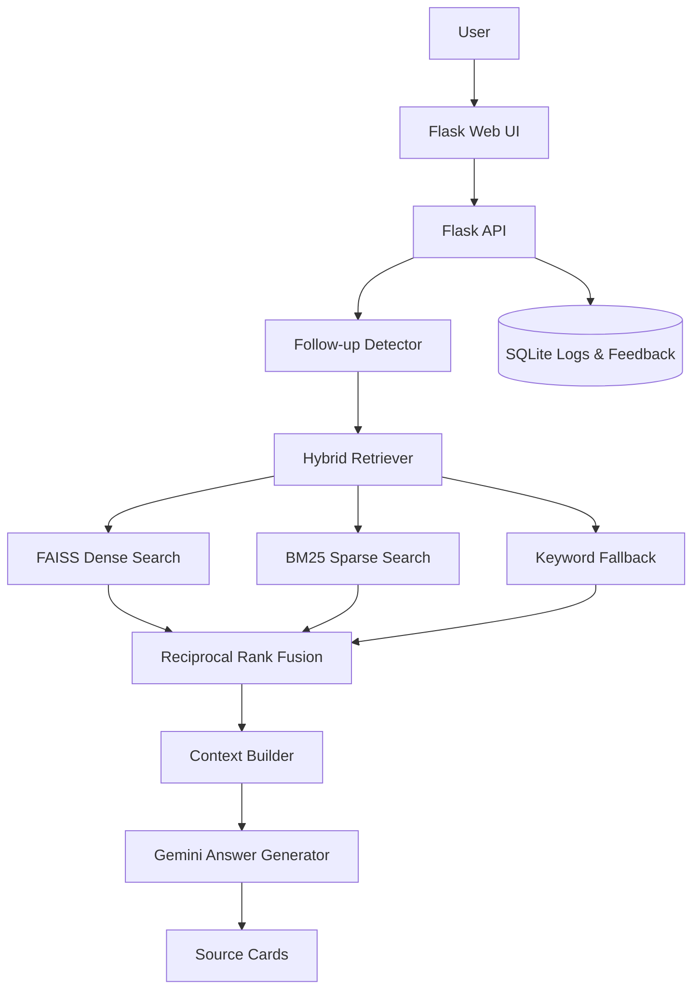

# Vietnamese eGov RAG Assistant

> 🌐 **Live Demo:** [https://egov-bot-cloud.vercel.app/](https://egov-bot-cloud.vercel.app/)

A production-ready Retrieval-Augmented Generation (RAG) chatbot for Vietnamese administrative procedures. Built with hybrid BM25 + FAISS retrieval, source-grounded Gemini generation, multi-turn conversation handling, and an automated FAQ-based evaluation pipeline.

## Key Results

Evaluated on 74 real FAQ questions from the Vietnamese National Public Service Portal:

| Method | Recall@1 | Recall@5 | Recall@10 | MRR@10 | nDCG@10 |
|--------|----------|----------|-----------|--------|---------|
| BM25   | 0.7432   | 0.9054   | 0.9324    | 0.8220 | 0.8496  |
| Dense  | 0.8514   | 0.9324   | 0.9324    | 0.8829 | 0.8953  |
| Hybrid | 0.8514   | 0.9324   | **0.9459** | 0.8820 | **0.8975** |

> Full benchmark report: [`evaluation/reports/faq_latest_report.md`](evaluation/reports/faq_latest_report.md)

## Features

- **Hybrid retrieval** over 12,000+ Vietnamese procedures with FAISS dense search, BM25 sparse search, and keyword fallback.
- **Source-grounded answers** with source cards and procedure links returned by `/chat`.
- **Multi-turn context** for follow-up questions within a session.
- **LLM-as-judge evaluation** for automated answer quality scoring (correctness, faithfulness, hallucination detection).
- **Retrieval ablation** comparing BM25, Dense, and Hybrid modes.
- **Latency profiling** with percentile reporting (p50/p90/p95/p99).
- **SQLite logging** for queries, feedback, and popular-procedure counters.
- **Docker** and Docker Compose support for deployment.

## Architecture



## Project Structure

```text
├── src/egov_bot/              # Core application
│   ├── api/                   # Flask route blueprints
│   ├── rag/                   # RAG pipeline, generation, prompt
│   ├── retrieval/             # Hybrid retriever (FAISS + BM25 + RRF)
│   ├── data/                  # Procedure store, resource loader
│   ├── conversation/          # Session & follow-up detection
│   ├── storage/               # SQLite DB layer
│   ├── schemas/               # Data models
│   └── utils/                 # Normalizer, cache, timing
├── evaluation/                # FAQ benchmark pipeline
│   ├── crawlers/              # FAQ data collection from DVC portal
│   ├── utils/                 # Text normalization, title matching, JSONL I/O
│   ├── testsets/              # Test data (JSONL)
│   ├── reports/               # Generated benchmark reports
│   ├── eval_retrieval_title.py    # Retrieval evaluation (title matching)
│   ├── eval_generation_judge.py   # Generation evaluation (LLM-as-judge)
│   ├── eval_latency_dataset.py    # Latency profiling
│   └── run_faq_benchmark.py       # Full benchmark orchestrator
├── scripts/                   # Dev utilities
├── notebooks/                 # Data exploration notebooks
├── docs/                      # Documentation & CV summary
├── static/                    # CSS, JS, data
├── templates/                 # HTML templates
├── tests/                     # Unit tests
├── app.py                     # WSGI entry point
├── Dockerfile
└── docker-compose.yml
```

## Quick Start

### Local Setup

```bash
python -m venv .venv

# Windows
.venv\Scripts\activate

# macOS/Linux
source .venv/bin/activate

pip install -r requirements.txt
cp .env.example .env
# Edit .env and set GOOGLE_API_KEY
python scripts/run_dev.py
```

Open `http://localhost:7860` in your browser.

> If `GOOGLE_API_KEY` is missing, the app still starts and returns source-extracted answers instead of Gemini-generated prose.

### Docker

```bash
cp .env.example .env
# Edit .env and set GOOGLE_API_KEY
docker compose up --build
```

The Compose setup mounts `.cache` and `user_data` directories so cached models and logs persist across restarts.

## Dataset

Data is loaded from the Hugging Face dataset `DrPie/eGoV_Data`:

| File | Purpose |
|------|---------|
| `index.faiss` | FAISS dense retrieval index |
| `metas.pkl.gz` | Chunk metadata (titles, text, URLs) |
| `bm25.pkl.gz` | Pre-built BM25 index |
| `toan_bo_du_lieu_final.json` | Raw procedure data (12,361 records) |

First startup downloads these files (~2.5GB total including the embedding model). Subsequent startups load from cache.

To prefetch resources: `python scripts/download_resources.py`

To use fully local data: `python scripts/build_local_index.py --input static/data/toan_bo_du_lieu_final.json --output-dir .cache/egov_data` and set `DATA_SOURCE=local` in `.env`.

## API Reference

### `GET /health`

Returns app status, resource-loading status, model availability, and version.

### `POST /chat`

```json
// Request
{"question": "Đăng ký khai sinh cần giấy tờ gì?", "session_id": "user-123"}

// Response
{
  "answer": "...",
  "sources": [{"title": "...", "url": "...", "score": 0.95, "snippet": "..."}],
  "request_id": "...",
  "latency_ms": 1234,
  "cached": false
}
```

### `GET /search?q=&limit=`

Returns procedure search results.

### `POST /feedback`

Stores `like`, `dislike`, or `neutral` feedback in SQLite.

### `POST /clear_session`

Clears in-memory conversation context for the provided `session_id`.

## Evaluation

The evaluation pipeline uses FAQ questions crawled from the National Public Service Portal. See [evaluation/README.md](evaluation/README.md) for the full data collection and benchmarking workflow.

### Running Benchmarks

```bash
# Start API server (terminal 1)
python scripts/run_dev.py

# Run full benchmark (terminal 2)
python evaluation/run_faq_benchmark.py \
    --testset evaluation/testsets/dvc_faq_qa_500.jsonl \
    --base-url http://localhost:7860 \
    --generation-limit 50

# Or run individual evaluations
python evaluation/eval_retrieval_title.py --mode hybrid
python evaluation/eval_generation_judge.py --base-url http://localhost:7860 --limit 50
python evaluation/eval_latency_dataset.py --base-url http://localhost:7860 --limit 100
```

Reports are generated in `evaluation/reports/`.

## Limitations

- Data may not reflect real-time changes from official portals.
- The assistant is not a substitute for official legal or administrative guidance.
- First startup can be slow (~2-5 min) due to model and index downloads.
- Free-tier Gemini API has strict rate limits (20 req/day for 2.5-flash; use 1.5-flash for benchmarking).
