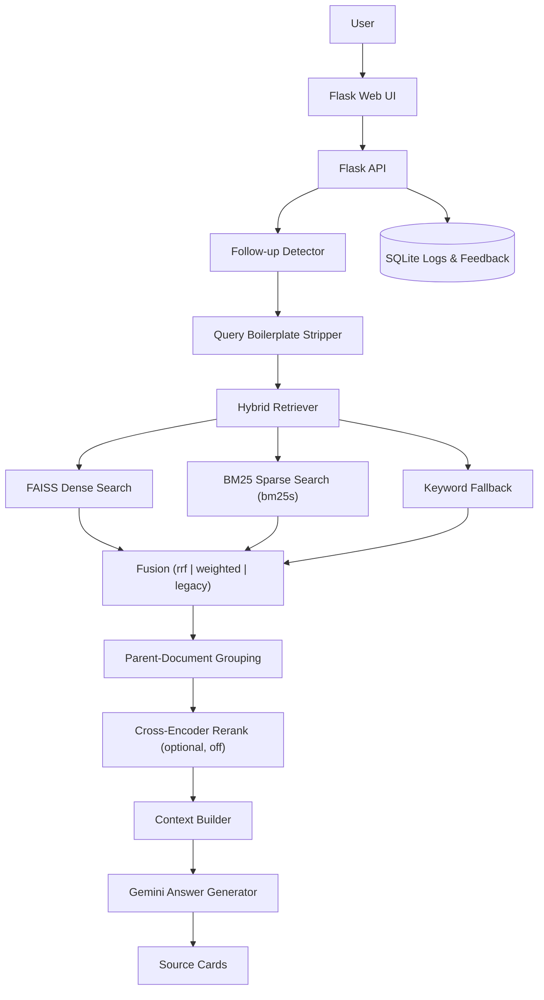

# Vietnamese eGov RAG Assistant

A Retrieval-Augmented Generation system over 12,361 Vietnamese administrative
procedures, with hybrid BM25 + FAISS retrieval, parent-document grouping,
source-grounded Gemini generation, and a benchmark that reports confidence
intervals rather than point estimates.

## Two deployments, two architectures

This repository is the **local/self-hosted** system described below.

| | This repository | [egov-bot-cloud.vercel.app](https://egov-bot-cloud.vercel.app/) |
|---|---|---|
| Retrieval | BM25 (`bm25s`) + FAISS, fusion, parent grouping | Pinecone dense-only, `topK=5` |
| Embeddings | local `sentence-transformers` | HuggingFace Inference API |
| Sparse / fusion | yes | **none** |
| Evaluation harness | yes | not applicable |

The hosted demo is a thin serverless port. It does **not** run the hybrid
pipeline, so the numbers below do not describe it.

## Retrieval results

Evaluated on **167** FAQ questions from the National Public Service Portal
(`evaluation/testsets/dvc_faq_clean_v2.jsonl`), with parent-document grouping
and query boilerplate stripping enabled:

| Method | Recall@1 | Recall@5 | Recall@10 | MRR@10 | nDCG@10 | p50 |
|--------|---------:|---------:|----------:|-------:|--------:|----:|
| BM25   | 0.7545 | 0.8503 | 0.9222 | 0.7853 | 0.8165 | 60 ms |
| Dense  | 0.7066 | 0.8503 | 0.9162 | 0.7564 | 0.7939 | 137 ms |
| Hybrid | 0.6826 | 0.7904 | 0.8443 | 0.7328 | 0.7593 | 224 ms |

**Read these as indistinguishable, not as a ranking.** A paired bootstrap over
10,000 resamples puts the 95% CI of every BM25-vs-Dense and BM25-vs-Hybrid
quality difference across zero at this sample size. Reproduce with
`evaluation/compare_runs.py`.

The differences that *do* survive the bootstrap:

| Change | Effect | 95% CI |
|---|---|---|
| Parent-document grouping | Recall@10 **+0.0599** | [+0.0299, +0.0958] |
| Parent-document grouping | nDCG@10 **+0.0255** | [+0.0133, +0.0392] |
| Query boilerplate stripping | nDCG@10 **+0.0147** | [+0.0034, +0.0292] |
| Tokenizer fix (`bm25s` backend) | sparse p50 **1,920 ms → 60 ms** | measured per query |
| BM25 vs Hybrid, paraphrased queries only | Recall@1 **+0.1719** | [+0.0469, +0.2969] |

### Cross-encoder reranking was measured and rejected

`AITeamVN/Vietnamese_Reranker` over a 20-candidate shortlist, n=167:

| | Recall@1 | Recall@10 | MRR@10 | nDCG@10 | p50 |
|---|---:|---:|---:|---:|---:|
| BM25 + grouping | **0.7545** | 0.9222 | **0.7853** | **0.8165** | **60 ms** |
| + reranking | 0.5269 | 0.8683 | 0.6181 | 0.6767 | 6,812 ms |

Reranking before grouping instead of after does not help (Recall@1 0.16 vs
0.20 on a 25-question probe), so the ordering is not the cause.

The failure is systematic: Recall@10 *rises* while Recall@1 collapses, and the
demoted cases are procedures whose titles differ only by a qualifier — `loại I`
vs `loại II` vs `loại III`, or a province suffix. A cross-encoder trained on
general Vietnamese text reads those variants as equally relevant and orders
them near-arbitrarily, while BM25 separates them on exactly those tokens.

At 6.8s per query on CPU it is also unusable on free-tier hosting. The stage is
kept behind `RERANK_ENABLED=false` with a configurable model, so a
domain-adapted reranker can be retried on a GPU.

### What limits this system

Recall saturates by depth 50 (`Recall@50 = Recall@100 = 0.9162`), so **8.4% of
questions never retrieve the correct procedure at any depth**. Reranking cannot
recover those; only better candidate generation can. Run
`evaluation/diagnose_retrieval_ceiling.py` to reproduce.

The benchmark is also lexically biased: **41.3% of its questions quote the
target procedure's title verbatim**, because the questions come from a portal
FAQ. Split by title-token overlap
(`evaluation/analyze_lexical_bias.py`), Recall@1 falls from ~0.80 on
title-quoting questions to ~0.62 on paraphrased ones. Treat the paraphrased
slice as the number that reflects real users.

> Earlier revisions of this file reported Recall@10 = 0.9459 on a 74-question
> set. That set was produced by a cleaning step that silently dropped every
> question whose title was not a verbatim corpus match, because `rapidfuzz` was
> missing from the environment and the ImportError was swallowed. The filter
> kept exactly the questions BM25 finds easiest. The 167-question set above
> restores them.

## Features

- **Hybrid retrieval** over 12,361 procedures: FAISS dense search, `bm25s` sparse
  search, and keyword fallback, with a tokenizer shared by index build and query.
- **Selectable fusion** — `rrf` (rank-only), `weighted` (score), or `legacy`
  (kept for reproducing older reports). Set via `FUSION_STRATEGY`.
- **Parent-document grouping** so one procedure cannot fill the top-k with its
  own chunks, with candidate depth scaled to compensate.
- **Query preprocessing** that strips administrative lead-ins from the retrieval
  query while the original question still reaches the answer prompt.
- **Optional cross-encoder reranking** (off by default — see the measurement below).
- **Source-grounded answers** with source cards and procedure links from `/chat`.
- **Multi-turn context** for follow-up questions within a session.
- **LLM-as-judge evaluation** for correctness, faithfulness, and hallucination.
- **Paired-bootstrap significance testing** so retrieval changes are reported
  with confidence intervals instead of point estimates.
- **Benchmark bias analysis** splitting results by question/title token overlap.
- **Latency profiling** with p50/p90/p95/p99 reporting.
- **SQLite logging** for queries, feedback, and popular-procedure counters.
- **Docker** and Docker Compose support for deployment.

## Architecture


```mermaid
flowchart TD
    U[User] --> UI[Flask Web UI]
    UI --> API[Flask API]
    API --> FD[Follow-up Detector]
    FD --> QR[Query Boilerplate Stripper]
    QR --> R[Hybrid Retriever]
    R --> D[FAISS Dense Search]
    R --> S["BM25 Sparse Search (bm25s)"]
    R --> K[Keyword Fallback]
    D --> F["Fusion (rrf | weighted | legacy)"]
    S --> F
    K --> F
    F --> G[Parent-Document Grouping]
    G --> RR["Cross-Encoder Rerank (optional, off)"]
    RR --> C[Context Builder]
    C --> LLM[Gemini Answer Generator]
    LLM --> SRC[Source Cards]
    API --> DB[(SQLite Logs & Feedback)]
```

## Project Structure

```text
├── src/egov_bot/              # Core application
│   ├── api/                   # Flask route blueprints
│   ├── rag/                   # RAG pipeline, generation, prompt
│   ├── retrieval/             # Hybrid retriever (FAISS + BM25 + RRF)
│   ├── data/                  # Procedure store, resource loader
│   ├── conversation/          # Session & follow-up detection
│   ├── storage/               # SQLite DB layer
│   ├── schemas/               # Data models
│   └── utils/                 # Normalizer, cache, timing
├── evaluation/                # FAQ benchmark pipeline
│   ├── crawlers/              # FAQ data collection from DVC portal
│   ├── utils/                 # Text normalization, title matching, JSONL I/O
│   ├── testsets/              # Test data (JSONL)
│   ├── reports/               # Generated benchmark reports
│   ├── eval_retrieval_title.py    # Retrieval evaluation (title matching)
│   ├── eval_generation_judge.py   # Generation evaluation (LLM-as-judge)
│   ├── eval_latency_dataset.py    # Latency profiling
│   └── run_faq_benchmark.py       # Full benchmark orchestrator
├── scripts/                   # Dev utilities
├── notebooks/                 # Data exploration notebooks
├── docs/                      # Documentation & CV summary
├── static/                    # CSS, JS, data
├── templates/                 # HTML templates
├── tests/                     # Unit tests
├── app.py                     # WSGI entry point
├── Dockerfile
└── docker-compose.yml
```

## Quick Start

### Local Setup

```bash
python -m venv .venv

# Windows
.venv\Scripts\activate

# macOS/Linux
source .venv/bin/activate

pip install -r requirements.txt
cp .env.example .env
# Edit .env and set GOOGLE_API_KEY
python scripts/run_dev.py
```

Open `http://localhost:7860` in your browser.

> If `GOOGLE_API_KEY` is missing, the app still starts and returns source-extracted answers instead of Gemini-generated prose.

### Docker

```bash
cp .env.example .env
# Edit .env and set GOOGLE_API_KEY
docker compose up --build
```

The Compose setup mounts `.cache` and `user_data` directories so cached models and logs persist across restarts.

## Dataset

Data is loaded from the Hugging Face dataset `DrPie/eGoV_Data`:

| File | Purpose |
|------|---------|
| `index.faiss` | FAISS dense retrieval index |
| `metas.pkl.gz` | Chunk metadata (titles, text, URLs) |
| `bm25.pkl.gz` | Pre-built BM25 index |
| `toan_bo_du_lieu_final.json` | Raw procedure data (12,361 records) |

First startup downloads these files (~2.5GB total including the embedding model). Subsequent startups load from cache.

To prefetch resources: `python scripts/download_resources.py`

To use fully local data: `python scripts/build_local_index.py --input static/data/toan_bo_du_lieu_final.json --output-dir .cache/egov_data` and set `DATA_SOURCE=local` in `.env`.

### Rebuilding the sparse index

The published `bm25.pkl.gz` predates the shared tokenizer. Rebuild it from the
existing chunk metadata — no re-embedding, about 25 seconds:

```bash
python scripts/rebuild_bm25_index.py
```

The result is written to `DATA_DIR`, which the resource loader prefers over the
Hugging Face copy. The index records the tokenizer version it was built with,
and the retriever compares its document count against the loaded chunk count,
so a stale or mismatched index logs an error instead of quietly returning
results about unrelated procedures.

## API Reference

### `GET /health`

Returns app status, resource-loading status, model availability, and version.

### `POST /chat`

```json
// Request
{"question": "Đăng ký khai sinh cần giấy tờ gì?", "session_id": "user-123"}

// Response
{
  "answer": "...",
  "sources": [{"title": "...", "url": "...", "score": 0.95, "snippet": "..."}],
  "request_id": "...",
  "latency_ms": 1234,
  "cached": false
}
```

### `GET /search?q=&limit=`

Returns procedure search results.

### `POST /feedback`

Stores `like`, `dislike`, or `neutral` feedback in SQLite.

### `POST /clear_session`

Clears in-memory conversation context for the provided `session_id`.

## Evaluation

The evaluation pipeline uses FAQ questions crawled from the National Public Service Portal. See [evaluation/README.md](evaluation/README.md) for the full data collection and benchmarking workflow.

Retrieval evaluation makes no LLM calls, so it can be re-run freely. Only
generation scoring consumes Gemini quota.

### Test sets

| File | Rows | Notes |
|---|---:|---|
| `dvc_faq_raw.jsonl` | 169 | Crawler output |
| `dvc_faq_clean_v2.jsonl` | 167 | **Current.** Exact + fuzzy title matching |
| `dvc_faq_qa_74.jsonl` | 74 | Exact-match only; kept to reproduce old reports |

`dvc_faq_qa_74.jsonl` was previously named `dvc_faq_qa_500.jsonl` despite
holding 74 rows.

### Running benchmarks

```bash
python evaluation/eval_retrieval_title.py \
    --testset evaluation/testsets/dvc_faq_clean_v2.jsonl \
    --mode bm25 --group
```

Useful flags: `--mode {bm25,dense,hybrid}`, `--fusion {rrf,weighted,legacy}`,
`--group/--no-group`.

### Analysis tools

```bash
# Is a difference real, or is it sample noise? Paired bootstrap, 10k resamples.
python evaluation/compare_runs.py \
    --baseline evaluation/reports/A_per_sample.jsonl \
    --candidate evaluation/reports/B_per_sample.jsonl

# Same, restricted to paraphrased questions.
python evaluation/compare_runs.py --baseline A.jsonl --candidate B.jsonl \
    --testset evaluation/testsets/dvc_faq_clean_v2.jsonl --coverage-below 0.8

# How much does the benchmark reward literal string matching?
python evaluation/analyze_lexical_bias.py --run bm25=...jsonl --run dense=...jsonl

# Where is retrieval losing the answer, and what could a reranker recover?
python evaluation/diagnose_retrieval_ceiling.py --mode bm25 --depth 100

# How much of each query is administrative boilerplate?
python evaluation/analyze_query_boilerplate.py
```

Reports are written to `evaluation/reports/`.

### Generation and latency

```bash
python scripts/run_dev.py   # terminal 1
python evaluation/eval_generation_judge.py --base-url http://localhost:7860 --limit 50
python evaluation/eval_latency_dataset.py --base-url http://localhost:7860 --limit 100
```

## Limitations

- **The benchmark rewards literal matching.** 41.3% of its questions quote the
  target title verbatim. Numbers on the paraphrased slice are the honest ones.
- **8.4% of questions are unreachable** by this retriever at any depth. That is
  a candidate-generation problem; reranking cannot address it.
- **Retrieval modes are statistically indistinguishable** at n=167. Do not read
  the results table as a ranking.
- Data may not reflect real-time changes from official portals.
- The assistant is not a substitute for official legal or administrative guidance.
- First startup can be slow (~2-5 min) due to model and index downloads.
- Free-tier Gemini API has strict rate limits (20 req/day for 2.5-flash; use 1.5-flash for benchmarking).
- The hosted demo runs a different, dense-only architecture. See the table at
  the top.
